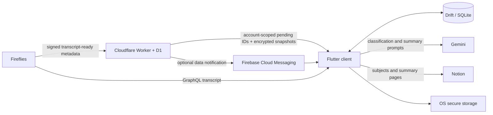

# ClassSync context

## Mission

ClassSync reduces the normal lecture workflow to zero clicks:

```text
Fireflies completes transcript
→ ClassSync discovers it through relay or recovery polling
→ active Notion subjects are loaded
→ Gemini classifies and summarizes the lecture
→ ClassSync publishes one structured page to Notion
→ success is recorded quietly
```

Ambiguous classification pauses before publishing and asks for one subject choice. Failures retain durable work and expose a useful recovery action.

V1 is complete only when this pipeline is dependable. Calendar, assessments, tasks, files, grades, and other academic modules are future extensions, not current UI placeholders.

## System boundaries



| System | Owns | Must not own |
|---|---|---|
| Fireflies | meeting metadata and transcripts | ClassSync queue state |
| Notion | subjects and published summaries | client credentials |
| Local SQLite | queue, checkpoints, cached subjects, preferences, corrections | API credentials |
| OS secure storage | Fireflies, Gemini, Notion, relay credentials | transcripts |
| Cloudflare D1 | account-scoped relay metadata and opaque encrypted snapshots | transcript or summary content |
| Gemini | transient classification/summary requests | durable application state |

Relay failure must degrade to Fireflies polling. Mobile/desktop failure must leave recoverable jobs. No device may rely on another device being online.

## Notion semantic model

Reusable installations map existing Notion data sources at runtime:

```text
University root
├─ subject list (canonical subjects)
├─ active-subject view
├─ summary history (publication target)
└─ semester notebooks/views
```

Current Portuguese property semantics:

- subject list: `Nome` or `Name`, `Ano`, `Semestre`, `Status`;
- optional classifier hints: `Aliases`, `Professores`, `Horário`;
- summary history: `Nome`, `Data`, `Cadeira`;
- optional ClassSync identity: `Fireflies ID`.

`Status = In progress` defines active subjects. Current subjects and semester are runtime data and must never become code constants. A linked semester feed displays correctly related summary-history pages; ClassSync does not duplicate those pages elsewhere.

## Domain vocabulary

- `AcademicSubject`: Notion-backed class/subject and optional classifier hints.
- `AcademicSemester`: derived display value when active subjects agree on year/semester.
- `LectureTranscript`: Fireflies or manual source content.
- `ClassificationResult`: `match`, `uncertain`, or `not_a_lecture`, plus heuristic confidence.
- `LectureSummary`: structured academic notes rendered by the Notion adapter.
- `SyncJob`: durable local workflow and remote checkpoints.
- `RelayEvent`: minimal transcript-ready coordination event.
- `FirefliesConnection`: named, stable source identity plus securely stored API
  key; one ClassSync account may own several permitted recorder sources.
- `ClassificationCorrection`: inspectable local hint derived from a manual choice.

Expected job states:

```text
discovered → queued → fetching_transcript → classifying → summarizing
→ needs_review | publishing → success

terminal alternatives: ignored, duplicate, failed_terminal
retry path: failed_retryable → queued/claimed processing
```

Processing states are checkpoints, not proof that a process is still alive. Startup must reclaim stale work safely.

## Platform roles

- Windows: primary unattended processor, tray, launch at login, periodic recovery, notifications, installer.
- Android: full shared pipeline, quick review/status UI, manual sync, FCM wake-up, WorkManager recovery. OS execution limits still apply.
- macOS/iOS: codebase compatibility target. Platform capabilities and signing need explicit validation before claiming production support.

Desktop uses a sidebar/navigation rail. Mobile uses bottom navigation. Implemented modules are Overview, Classes, Library, Sync, and Settings.

## Decisions already recorded

- `docs/architecture/adr-001-modular-monolith.md`: shared Flutter modular monolith.
- `docs/architecture/adr-002-d1-relay.md`: one Worker and D1 for minimal durable relay state.
- `docs/architecture/adr-003-global-idempotency.md`: optional Notion Fireflies identity metadata.
- `docs/architecture/adr-005-private-account-device-sync.md`: tenant separation and end-to-end encrypted device sync.
- `docs/architecture/adr-006-named-fireflies-sources.md`: permitted colleague
  recorders and multiple named Fireflies credentials.

Changing cross-device coordination or remote idempotency requires a new ADR because simple client-side check-then-create cannot provide a global uniqueness guarantee.

## Documentation map

- `README.md`: product, setup, build, and privacy overview.
- `docs/architecture.md`: boundaries and ownership.
- `docs/sync-flow.md`: shared pipeline.
- `docs/fireflies.md`, `docs/gemini.md`, `docs/notion.md`, `docs/cloudflare.md`, `docs/firebase.md`: integration contracts.
- `docs/background-processing.md`: platform execution model.
- `docs/troubleshooting.md`: user-facing diagnostics.
- `docs/implementation-plan.md`: delivery order and definition of done.

## Current implementation baseline

The repository is an initial implementation on branch `main`. The first implementation commit was pushed while this context was prepared; GitHub/Firebase deployment state remains external and potentially concurrent. Local source includes Flutter client, Worker/D1 relay, setup and management UI, mocked pipeline tests, CI workflows, and Windows installer definition. Passing local unit tests does not establish crash safety, multi-device uniqueness, real API compatibility, background reliability, or signed release readiness.
