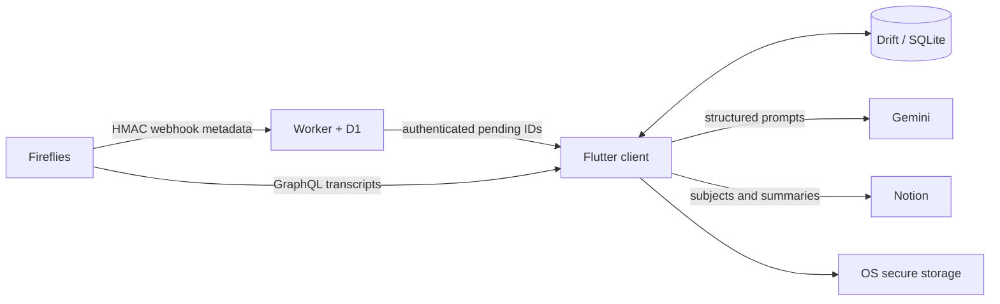

# ClassSync

Local-first university manager and unattended lecture pipeline for Flutter.
ClassSync discovers completed Fireflies transcripts, classifies and summarizes
them with Gemini, and publishes structured study notes to Notion.


## What is included

- Adaptive Flutter client for Windows, Android, macOS, and iOS.
- Durable Drift/SQLite queue with retries, review states, local cache, manual
  transcript import, and per-job timelines.
- Fireflies GraphQL pagination plus signed Webhooks V2 ingestion.
- Gemini structured classification and long-transcript summarization.
- Notion data-source discovery, subject filtering, schema opt-in, global
  Fireflies-ID deduplication, and retry-safe chunked page publishing.
- Controlled regenerate, reclassify, and republish actions update the existing
  Notion page instead of creating a duplicate.
- Minimal Cloudflare Worker + D1 relay storing IDs and timestamps only.
- Windows tray, close-to-tray, periodic polling, autostart, notifications, and
  an Inno Setup installer definition.
- Android WorkManager background sync and user-controlled notifications.
- Firebase Cloud Messaging fast-path using project
  `classsync-obl1vi0uzz`, with authenticated device registration.

## Architecture



Notion and Fireflies remain the content systems of record. The relay never sees
transcripts or summaries. Credentials stay in OS secure storage; SQLite holds
operational state and user preferences. See [architecture](docs/architecture.md)
and [sync flow](docs/sync-flow.md).

## Run the client

Prerequisites: current Flutter stable, Visual Studio Desktop C++ tools for
Windows, and Android Studio/SDK for Android. On Windows, enable Developer Mode so
Flutter can create plugin symlinks.

```powershell
cd apps/client
flutter pub get
flutter run -d windows
# or
flutter run -d android
```

The first-run wizard tests Fireflies, Gemini, and Notion; discovers the shared
Notion data sources; asks before adding the optional `Fireflies ID` property;
and configures automation. No key is compiled into the app.

Required Notion data-source properties:

- **Lista de Cadeiras:** `Nome` (or `Name`), `Ano`, `Semestre`,
  `Status`; optional `Aliases`, `Professores`, `Horário`.
- **Histórico de Resumos:** `Nome`, `Data`, `Cadeira`; optional
  `Fireflies ID`, which enables cross-device idempotency.

## Deploy the relay

```powershell
pnpm install
cd apps/relay
pnpm exec wrangler login
pnpm exec wrangler d1 create classsync-relay
# Paste the returned database_id into wrangler.jsonc.
pnpm exec wrangler d1 migrations apply classsync-relay --remote
pnpm exec wrangler secret put FIREFLIES_WEBHOOK_SECRET
pnpm exec wrangler secret put DEVICE_API_TOKEN
pnpm deploy
```

Register `https://<worker>/webhooks/fireflies` as a Fireflies Webhooks V2
endpoint for `meeting.transcribed`, using the same webhook secret. Put the
Worker base URL and device token into ClassSync. Full details are in
[Cloudflare setup](docs/cloudflare.md) and [Fireflies setup](docs/fireflies.md).

## Verify and package

```powershell
pnpm relay:check
cd apps/client
dart format --output=none --set-exit-if-changed lib test
flutter analyze
flutter test
flutter build windows --release
flutter build apk --release
```

After the Windows release build, compile
`packaging/windows/classsync.iss` with Inno Setup. CI performs checks without
real credentials and publishes a Windows installer artifact.

Pushing a `v*` tag attaches `ClassSync-Android.apk` and the Windows Setup
executable to a GitHub Release. Android signing credentials stay in GitHub
Actions secrets, preserving the signing identity across upgrades.

## Privacy and failure behavior

- Logs and diagnostics redact tokens, Authorization headers, transcripts, and
  generated summaries.
- Automatic cleanup can remove completed transcript payloads while retaining
  audit metadata.
- Relay loss falls back to overlap-window Fireflies polling.
- Ambiguous classes stop in **Needs review**; terminal and retryable failures are
  distinct.
- Notion pages are created empty and the remote child count acts as a durable
  checkpoint, preventing duplicate append chunks after an interrupted request.

See [background processing](docs/background-processing.md), integration guides
under [docs](docs), [Firebase setup](docs/firebase.md), and
[troubleshooting](docs/troubleshooting.md).
