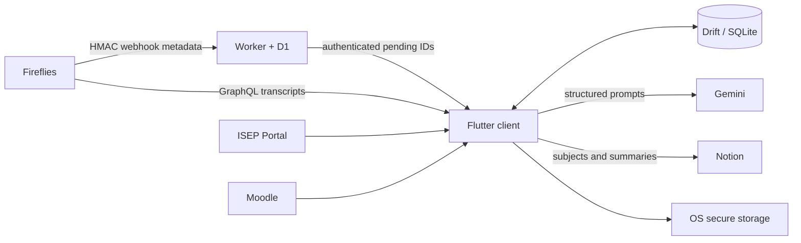

# ClassSync

Local-first university manager and unattended lecture pipeline for Flutter.
ClassSync discovers completed Fireflies transcripts, classifies and summarizes
them with Gemini, and publishes structured study notes to Notion.


## What is included

- Flutter client for Windows and Android; macOS receives compile coverage but
  remains preview-only. iOS automation is not configured.
- Durable Drift/SQLite queue with retries, review states, local cache, manual
  transcript import, and per-job timelines.
- Multiple named Fireflies GraphQL connections with independent pagination,
  stable Fireflies account identity, plus signed Webhooks V2 ingestion.
- Optional Gemini class identification with a lightweight default model,
  manual class choice/correction, named model dropdowns, and long-transcript
  summarization.
- Notion schema validation, subject filtering, D1-backed global processing
  claims, and retry-safe ClassSync-owned page sections.
- Controlled regenerate, reclassify, and republish actions update the existing
  Notion page instead of creating a duplicate.
- Job details expose the complete transcript in a full-screen reader on mobile
  and distinguish locally retained content from status synced by another device.
- Minimal Cloudflare Worker + D1 relay storing IDs and timestamps only.
- Private per-person account namespaces with AES-256-GCM device sync for keys,
  shared preferences, and bounded lecture status metadata.
- In-app Notion Library grouped by academic semester, with readable summary
  pages and a direct Open in Notion action.
- Read-only ISEP Portal integration for enrolment, timetable, official exams,
  published grades, and academic history, with fail-closed WebForms parsing.
- Moodle Web Services integration for enrolled courses, assignments, and
  announcements; ambiguous subject mappings stay reviewable.
- Focused offline Academic hub with a responsive weekly timetable: desktop
  time-by-weekday grid or agenda, mobile agenda or horizontally scrollable grid,
  fixed 50-minute ISEP period rows, and explicit class, room, and teacher
  details. Longer classes occupy every period they span. Timetable and Tasks stay
  directly accessible; Evaluations, Grades & progress, and Finance live under
  the compact More menu.
- Lecture action extraction with evidence, editable lifecycle state, and
  deadline calendar integration; regeneration preserves user decisions.
- Read-only Portal notices, official lesson summaries, exam-registration
  windows, enrolment/history, and ECTS progress with stable provenance and
  change detection.
- Read-only Portal tuition, fee, and complete upcoming instalment tracking with
  optional advance reminders and daily due-date reminders until Portal reports
  payment; full payment references are never stored.
- Windows tray, close-to-tray, periodic polling, autostart, notifications, and
  an Inno Setup installer definition.
- Android WorkManager background sync and user-controlled notifications.
- Firebase Cloud Messaging fast-path using project
  `classsync-obl1vi0uzz`, with authenticated device registration.

## Architecture



Notion and Fireflies remain the content systems of record. The relay never sees
transcripts or summaries. Credentials stay in OS secure storage; SQLite holds
operational state and user preferences. See [architecture](docs/architecture.md)
and [sync flow](docs/sync-flow.md).

## Run the client

Prerequisites: current Flutter stable, Visual Studio Desktop C++ tools for
Windows, and Android Studio/SDK for Android. On Windows, enable Developer Mode so
Flutter can create plugin symlinks.

```powershell
cd apps/client
flutter pub get
flutter run -d windows
# or
flutter run -d android
```

Already have a ClassSync account? Choose **Use recovery code** on the welcome
screen before entering any API keys. Recovery restores the encrypted saved
configuration, then asks for this device's automation preferences. It requires
no bootstrap token and preserves the existing Fireflies webhook. The first
device must have finished setup and synced its configuration.

The first-run wizard links to the public
[ClassSync Notion template](https://checker-dryer-7e3.notion.site/ClassSync-Template-3d387b0ef0908153a466c7aa2f8f7332),
tests a named Fireflies source, Gemini, and Notion; discovers the shared
Notion data sources; asks before adding the optional `Fireflies ID` property;
uses the hosted production relay URL by default; creates or joins a private
device account with a display name; shows its unique Fireflies webhook
settings; and configures automation. More named Fireflies keys can be added for
permitted colleague recorders without sharing the ClassSync recovery code.
See the [step-by-step setup guide](docs/setup.md). No private Fireflies, Gemini,
Notion, relay, or
Firebase service-account credential is compiled into the app. FlutterFire's
Firebase API key is a public client identifier and should still be restricted
to expected apps/APIs in Google Cloud.

Required Notion data-source properties:

- **Lista de Cadeiras:** `Nome` (or `Name`), `Ano`, `Semestre`,
  `Status`; optional `Aliases`, `Professores`, `Horário`.
- **Histórico de Resumos:** `Nome`, `Data`, `Cadeira`; optional
  `Fireflies ID`, which helps reconciliation after interrupted publication.

Optional academic integrations can be skipped during first-run setup and are
also configured under **Academic → Connections**.
One ISEP username/password connects Portal and Moodle; a separate Moodle login
remains available for external accounts. Portal credentials and the Moodle app
token stay in OS secure storage and travel between the owner's devices only
inside the encrypted account snapshot. Moodle obtains its token from the official
login endpoint and never stores the submitted password. Portal login
recognizes the actual sign-in form, including when the
authenticated dashboard contains account password controls. A local Windows
login diagnostic is documented in the Portal guide. Academic records remain in
the local offline cache and never pass through the relay. Automatic refresh uses
per-feature cache ages and reprioritizes pending Portal requests when the user
changes Academic section. See [ISEP Portal details](docs/isep-portal.md) and
[Moodle details](docs/moodle.md).

Upgrades automatically remove identifiable Portal form/menu records from the
academic cache on startup, including offline. Valid records and manual tasks
are preserved. Academic **Reload** fetches every configured academic source;
the small wheel beside each page title refreshes only that page. Local Tasks
simply rereads the offline cache. Timetable refresh loads the selected week and
the following four weeks from Portal; opening an uncached week triggers the
same focused refresh. Academic history uses the latest dated completed
curriculum block, preventing the Portal's duplicated unscoped rows from
inflating earned ECTS. Unavailable data is shown as uncached.

## Deploy the relay

```powershell
pnpm install
cd apps/relay
pnpm exec wrangler login
pnpm exec wrangler d1 create classsync-relay
# Paste the returned database_id into wrangler.jsonc.
pnpm exec wrangler d1 migrations apply classsync-relay --remote
pnpm exec wrangler secret put FIREFLIES_WEBHOOK_SECRET
pnpm exec wrangler secret put DEVICE_API_TOKEN
pnpm deploy
```

The setup wizard creates an account-specific `https://<worker>/webhooks/fireflies/<account>`
endpoint and shows its 32-character signing secret. Register those values in
Fireflies Webhooks V2 for `meeting.transcribed`; Fireflies currently requires
this dashboard step and exposes no public saved-webhook configuration API.
Legacy single-user installs can
continue using `/webhooks/fireflies`. Full details are in
[Cloudflare setup](docs/cloudflare.md) and [Fireflies setup](docs/fireflies.md).

## Verify and package

```powershell
pnpm relay:check
cd apps/client
dart format --output=none --set-exit-if-changed lib test
flutter analyze
flutter test
flutter build windows --release
flutter build apk --release
```

After the Windows release build, compile
`packaging/windows/classsync.iss` with Inno Setup. CI performs checks without
real credentials and publishes a Windows installer artifact.

Pushing a `v*` tag validates both projects, requires Android and Windows signing
secrets, builds APK/AAB plus Authenticode-signed Windows installer, generates
checksums and provenance, then publishes every artifact in one gated job.

To build and optionally publish the APK and Windows installer entirely on a
Windows development machine, without GitHub Actions, run:

```powershell
.\tool\release-local.ps1
.\tool\release-local.ps1 -Publish -NotesFile .\release-notes.md
```

The publishing mode requires GitHub CLI authentication, the existing Android
signing configuration, and `[skip ci]` in the release commit. It refuses to
push the version tag otherwise, preventing the tag-triggered workflow from
starting.

Back up `apps/client/android/app/classsync-release.jks` in a password manager
that supports file attachments, together with its key alias, store password,
and key password. All four items are required to sign an installable update.
The local rotation helper additionally protects a recovery copy of the signing
metadata with Windows DPAPI under the current Windows account. Key rotation is
deliberately explicit because an APK signed by a different key cannot update an
existing installation:

```powershell
.\tool\rotate-android-signing.ps1 -ConfirmRotation -UpdateGitHubSecrets
```

## Privacy and failure behavior

- Logs and diagnostics redact tokens, Authorization headers, transcripts, and
  generated summaries.
- Automatic cleanup can remove completed transcript payloads while retaining
  audit metadata.
- Relay loss falls back to overlap-window Fireflies polling.
- Ambiguous or manual-only classifications stop in **Needs review**. A selected
  class can be changed later without creating a second Notion page.
- Terminal and retryable failures are distinct. Successful transitions clear
  obsolete errors; repeated Gemini failures can offer a named alternative model
  while the durable retry schedule remains active.
- Generated Notion content lives in revision-marked ClassSync-owned toggles.
  Retries reconcile markers; regeneration never deletes user/template blocks.
- Transcript and summary checkpoints are plaintext inside OS-protected app data.
  Completed payloads are removed by default; abandoned content follows retention
  settings and can be purged manually.

See [background processing](docs/background-processing.md), integration guides
under [docs](docs), [Firebase setup](docs/firebase.md), and
[troubleshooting](docs/troubleshooting.md).
