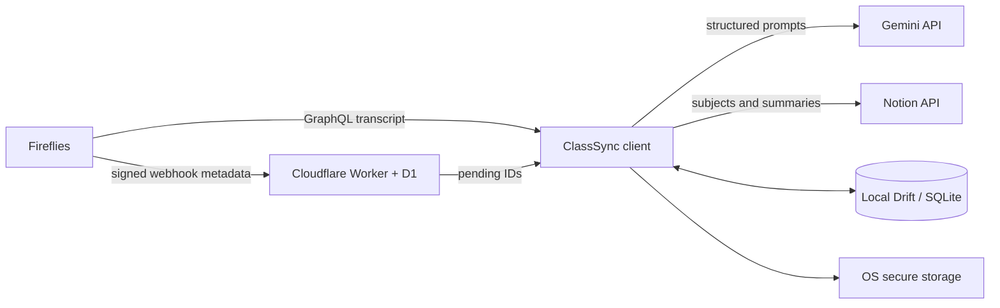

# Architecture

ClassSync is a local-first modular monolith plus a minimal coordination relay.

## Client boundaries

- `app`: bootstrap, routing, adaptive application shell, theme.
- `core`: database, security, networking, diagnostics, background services.
- `domain/academic`: semesters, subjects, lectures, summaries.
- `domain/sync`: durable jobs, transitions, retry policy, coordinator.
- `features`: overview, classes, sync, setup, settings.
- `platform`: Windows tray/autostart and mobile background hooks.

Features depend on domain contracts. Integration adapters depend on Dio and secure storage. Domain code does not import Flutter widgets or platform plugins.

## Data ownership

- Notion: canonical subjects and published summaries.
- Fireflies: canonical transcript source.
- Local SQLite: operational queue, cache, preferences, diagnostics, corrections.
- Cloudflare D1: transcript-ready IDs, per-device acknowledgements, hashed
  device identity, processing claims, and bounded push-delivery metadata.
- OS secure storage: all credentials.

See ADRs under `docs/architecture/` for trade-offs.
